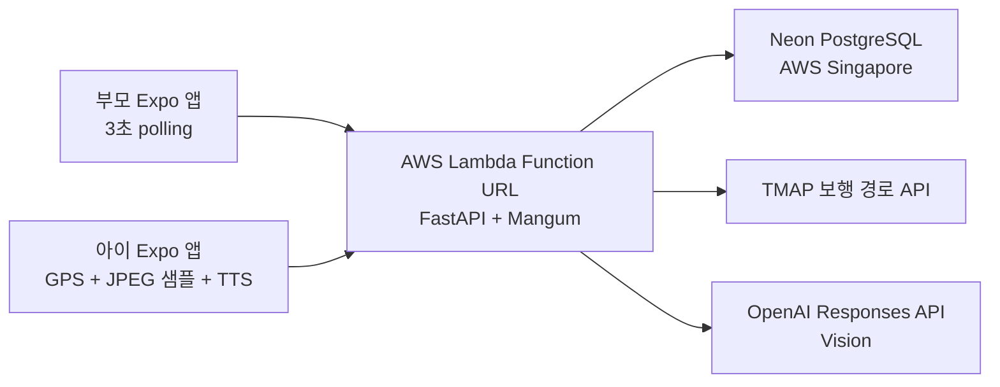

# Architecture

> 상태: Active<br>
> 최종 갱신: 2026-08-16

## 시스템 컨텍스트



실행 애플리케이션은 `frontend/`의 Expo 앱과 `backend/`의 FastAPI 모놀리스다. 백엔드는 AWS Lambda Python 3.12 한 개와 Function URL에 배포하며 Neon과 같은 `ap-southeast-1`을 사용한다. WebSocket·queue·별도 worker 없이 HTTP 요청 안에서 처리한다.

## 저장소 구조

```text
.
├── frontend/        # Expo 애플리케이션과 앱 전용 설정
├── backend/         # FastAPI 모놀리스와 uv 프로젝트 설정
├── docs/            # 스펙, 아키텍처, 구현 계획, ADR, 개발 규칙
├── .github/         # GitHub 협업 설정
└── AGENTS.md        # 문서 인덱스
```

## 경계와 책임

| 영역 | 책임 | 금지 사항 |
| --- | --- | --- |
| `frontend/` | 화면, GPS·카메라 수집, JPEG 샘플링, TTS·진동, polling | 서버 비밀값 보관, 권한·안전 판정 |
| `backend/src/app/api/` | HTTP 입력 검증, 역할 의존성, 응답·오류 계약 | 외부 SDK와 SQL 직접 호출 |
| `backend/src/app/services/` | 상태 전이, 길안내, 비전 clamp, 이벤트 조합 | 프런트 UI 세부사항 |
| `backend/src/app/repositories/` | SQLAlchemy 영속성 경계 | HTTP와 외부 API 판단 |
| `backend/src/app/integrations/` | TMAP·OpenAI 호출과 외부 응답 정규화 | 사용자용 문구와 상태 전이 |
| `backend/src/app/schemas/` | API·내부 adapter DTO와 enum | I/O 실행 |
| `backend/src/app/core/` | 환경 설정과 공통 오류·로그 정책 | 도메인 기능 |
| `docs/` | 스펙, 구조, 병렬 계획, 의사결정 | 실행 코드 |

의존 방향은 `api → services → repositories/integrations`다. 외부 구현은 adapter 뒤에 두어 단위 테스트가 네트워크 없이 실행되게 한다.

## 핵심 컴포넌트

- `MissionService`: 생성, 참여, 역할 token, 상태 전이, 안전 귀가
- `NavigationService`: 저장된 TMAP 경로 progress, 회전, 역방향·이탈·도착
- `RoadVisionService`: 도로 이미지 판단을 안전 enum과 고정 문구로 clamp
- `ItemVisionService`: 상품 조건 비교와 마지막 판정 저장
- `ParentSnapshotService`: 현재 aggregate와 cursor 이후 이벤트 조회
- `MissionRepository`: 세 테이블의 트랜잭션과 query
- `TmapClient`, `OpenAIVisionClient`: 외부 API adapter

## 데이터 흐름

### 생성·참여

1. 부모가 집·마트 좌표와 상품 목록을 전송한다.
2. backend가 TMAP에서 집→마트와 마트→집 보행 경로를 조회한다.
3. 왕복 경로 JSON과 token hash를 Neon에 저장한다.
4. 부모에게 `missionId`, 6자리 `joinCode`, 서버 설정으로 계산한 `joinCodeExpiresAt`, `parentToken`을 반환한다.
5. 아이가 코드로 참여하면 서버가 해당 만료 시각을 기준으로 코드를 소비하고 `childToken`, `GOING`, 첫 안내를 반환한다. 존재하지 않음, 만료됨, 이미 사용됨은 각각 `JOIN_CODE_INVALID`, `JOIN_CODE_EXPIRED`, `JOIN_CODE_ALREADY_USED` 오류로 구분한다.

### 이동

1. 아이가 2~3초마다 위치·정확도·heading·speed를 전송한다.
2. backend는 캐시된 경로의 최근접 point와 progress를 계산한다.
3. 유효 위치 2회 기준으로 역방향·이탈·도착을 debounce한다.
4. 다음 행동 문구와 진동 hint를 반환하고 필요한 이벤트를 저장한다.
5. 부모는 3초 polling으로 최신 위치와 cursor 이후 이벤트를 조회한다.

GPS update마다 TMAP을 재호출하지 않는다. 실제 경로가 없으면 직선 방향을 대신 안내하지 않는다.

### 도로 비전

1. 아이 앱은 연속 영상을 보내지 않고 3~5초마다 1MB 이하 JPEG 한 장을 전송한다.
2. 요청의 `capturedAt`이 서버 시각보다 10초 넘게 오래되었거나 5초 넘게 미래이면 OpenAI를 호출하지 않는다.
3. backend는 `missions.road_vision_lease_until`을 조건부 update해 10초 lease를 얻는다. lease를 얻지 못한 겹친 프레임은 버린다.
4. OpenAI 구조화 결과를 `STOP | CAUTION | UNKNOWN`으로 제한한다.
5. 저장된 현재 TMAP step이 횡단보도이거나 AI 오류·stale frame이면 보수적 정지 안내를 우선한다.
6. 정규화된 event만 저장하고 이미지와 raw model text는 폐기한다.

### 상품·귀가

1. 아이가 근접 상품 JPEG를 전송한다.
2. 이름·브랜드·용량을 기준으로 `MATCH | SIMILAR | MISMATCH | UNKNOWN`을 반환한다.
3. 마지막 판정만 저장한다.
4. 모든 상품이 `MATCH`이면 서버가 캐시된 귀가 경로를 활성화한다. 상품 결과와 무관한 수동
   귀가 명령은 부모 token만 호출할 수 있으며, 아이 앱은 이 endpoint를 직접 호출하지 않는다.
5. 집 도착 시 `COMPLETED`와 부모 완료 이벤트를 만든다.

## 데이터 모델

| 테이블 | 책임 |
| --- | --- |
| `missions` | 상태, token hash, 장소, 왕복 route JSON, 최신 위치, 현재 step, progress, 판정 streak, 도로 비전 lease |
| `mission_items` | 요청 상품 조건과 마지막 정규화 판정 |
| `mission_events` | 상태·위험·도착 이벤트와 증가하는 `eventId` |

PostGIS와 위치 이력 테이블은 사용하지 않는다. 거리와 bearing은 애플리케이션 순수 함수로 계산한다. 원본 도로·상품 이미지는 어떤 테이블에도 저장하지 않는다.

## 배포 구조

- 리전: AWS `ap-southeast-1`
- compute: Lambda Python 3.12
- HTTP: Function URL, application bearer token 권한
- ASGI adapter: Mangum
- DB: Neon Free PostgreSQL Singapore pooled SSL endpoint
- schema init: 3시간 버전에서는 `Base.metadata.create_all()`
- 패키징: Linux x86_64용 `psycopg[binary]` wheel을 포함한 zip

App Runner, API Gateway, RDS, VPC, S3, Redis, queue는 사용하지 않는다.

## 오류와 안전 계약

- 오류 응답: `{ "error": { "code": "...", "message": "..." } }`
- TMAP 최초 실패: 미션 생성 실패. 경로 추측 금지
- OpenAI 도로 실패: `UNKNOWN`, 정지 안내, `VISION_UNAVAILABLE` event
- OpenAI 상품 실패: `UNKNOWN`, 다시 비추거나 부모에게 확인 안내
- GPS 정확도 30m 초과: 역방향으로 단정하지 않고 위치 확인 안내
- Neon 실패: 503. 저장 성공처럼 응답하지 않음
- 금지 결과: `GO`, `CROSS_OK`, 횡단 허가 문구

## 품질 속성

- 변경 용이성: 기능별 router/service/schema가 서로 다른 파일을 소유한다.
- 테스트 가능성: repository와 integration을 dependency override할 수 있다.
- 복구 가능성: OpenAI 실패가 GPS 길안내를 막지 않는다.
- 최소 데이터: 최신 위치와 정규화 판정만 저장한다.
- 안전 우선: 비전은 위험을 추가 경고할 수만 있고 기존 정지 규칙을 완화하지 못한다.
- 시간 제한: 02:20 이후 새 기능을 중단하고 통합과 P0 수정만 수행한다.

병렬 작업 순서와 파일 소유권은 [`backend-parallel-implementation-plan.md`](backend-parallel-implementation-plan.md)를 따른다.
