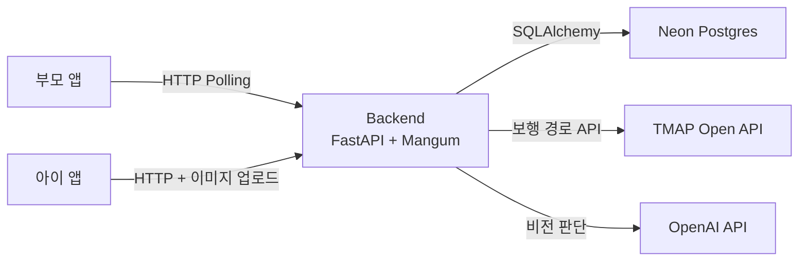
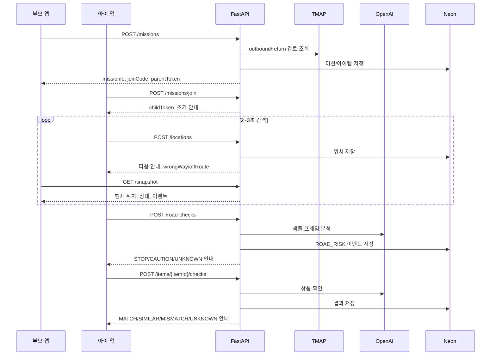

# Architecture

> 상태: Active<br>
> 최종 갱신: 2026-08-16

## 시스템 컨텍스트



실행 애플리케이션은 `frontend/`의 Expo 앱과 `backend/`의 FastAPI 서버입니다. 데모 단계의 백엔드는 단일 FastAPI 모놀리스로 구현하고 AWS Lambda Function URL에 Mangum 어댑터로 배포하는 것을 기준으로 둡니다. 패키지·가상환경·잠금 파일은 `uv`가 소유합니다.

## 저장소 구조

```text
.
├── frontend/        # Expo 애플리케이션과 앱 전용 설정
├── backend/         # FastAPI 모놀리스와 uv 프로젝트 설정
├── docs/            # 스펙, 아키텍처, ADR, 개발 규칙
├── .github/         # GitHub 협업 설정
└── AGENTS.md        # 문서 인덱스
```

루트에는 저장소 전체에 적용되는 설정과 문서만 둡니다. 개인 도구 설정은 저장소에 포함하지 않고 `.gitignore`로 제외합니다. 특정 애플리케이션에서만 사용하는 소스, 자산, 패키지 설정은 해당 애플리케이션 디렉터리에 둡니다.

## 경계와 책임

| 영역 | 책임 | 금지 사항 |
| --- | --- | --- |
| `frontend/` | 화면, 라우팅, 사용자 상호작용, 클라이언트 상태, API 호출 | 서버 비밀값 보관, 핵심 권한 판정 |
| `backend/` | 비즈니스 규칙, 데이터 접근, 인증·권한, 외부 서비스 연동 | UI 표현 로직, 프런트엔드 구현 세부사항 |
| `docs/` | 스펙, 구조, 의사결정, 협업 규칙 | 실행 코드 |
| 저장소 루트 | 공통 도구 설정과 진입점 | 앱 전용 소스와 패키지 설정 |

## 프런트엔드 내부 구조

| 경로 | 책임 |
| --- | --- |
| `frontend/app/` | Expo Router 화면과 라우트 레이아웃 |
| `frontend/components/` | 재사용 가능한 UI 컴포넌트 |
| `frontend/hooks/` | 공통 React 훅 |
| `frontend/constants/` | 테마 등 정적 설정 |
| `frontend/assets/` | 이미지와 정적 자산 |
| `frontend/scripts/` | 개발 보조 스크립트 |

## 백엔드 내부 구조

| 경로 | 책임 |
| --- | --- |
| `backend/src/app/api/` | HTTP 라우트와 라우터 조합 |
| `backend/src/app/core/` | 설정, 공통 예외, 로깅, 앱 조립 보조 |
| `backend/src/app/db/` | SQLAlchemy 엔진, 세션, 모델 베이스 |
| `backend/src/app/integrations/` | TMAP, OpenAI 외부 API 어댑터 |
| `backend/src/app/schemas/` | API 경계의 요청·응답 모델 |
| `backend/src/app/services/` | 상태 전이, 길안내, 알림, 상품 확인 규칙 |
| `backend/src/app/repositories/` | 향후 데이터베이스·외부 저장소 어댑터 |
| `backend/tests/unit/` | 외부 I/O 없는 단위 테스트 |
| `backend/tests/integration/` | 애플리케이션 경계를 통과하는 통합 테스트 |

저장소가 도입되면 API 계층이 저장소 세부사항을 직접 알지 않도록 `repositories/`에 어댑터를 추가합니다. 외부 API 호출은 `integrations/`, 상태 전이와 판단 조합은 `services/`가 소유합니다.

## 기본 의존 원칙

- 프런트엔드는 문서화된 API 계약에만 의존합니다.
- 백엔드는 프런트엔드 구현 세부사항에 의존하지 않습니다.
- 외부 서비스 호출과 비밀값 사용은 백엔드 경계 안에 둡니다.
- 공유 계약이 필요하면 중복 복사하지 않고 위치를 ADR로 결정합니다.
- 애플리케이션은 서로 독립적으로 의존성을 설치하고 실행할 수 있어야 합니다.

## 데이터 흐름



원칙:

- 부모 화면은 2~3초 polling을 사용한다.
- 아이 기기에서 카메라는 계속 사용할 수 있지만, 백엔드는 샘플 프레임만 처리하고 원본 이미지를 저장하지 않는다.
- 도로 판단 응답은 반드시 `STOP`, `CAUTION`, `UNKNOWN` 중 하나로 정규화한다.
- 길안내 실패 시에도 귀가 흐름을 막지 않는다.

## 배포 구조

- 프런트엔드: Expo 기반 iOS, Android, Web 실행을 지원합니다.
- 백엔드: FastAPI ASGI 서버를 로컬에서 실행하고, 데모 기준 배포 대상은 AWS Lambda Python 3.12 + Function URL입니다.

## 품질 속성

- 변경 용이성: 프런트엔드와 백엔드를 독립적으로 실행·검증할 수 있어야 합니다.
- 보안: 입력을 신뢰하지 않으며 서버 경계에서 다시 검증합니다.
- 안전: 도로 횡단 안전을 확정하는 표현을 생성하지 않고 주의 행동만 유도합니다.
- 복구 가능성: 외부 연동 실패가 전체 프로세스를 불명확하게 중단시키지 않아야 합니다.
