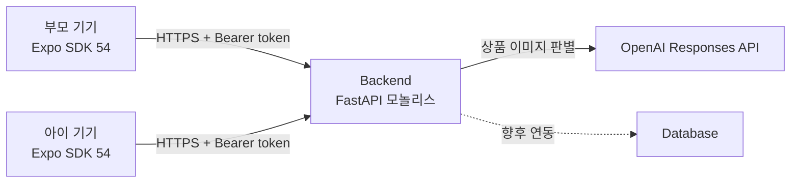

# Architecture

> 상태: Active<br>
> 최종 갱신: 2026-08-16

## 시스템 컨텍스트



실행 애플리케이션은 `frontend/`의 Expo 앱과 `backend/`의 FastAPI 서버입니다. 데모 단계의 백엔드는 단일 프로세스 모놀리스로 실행하며, 패키지·가상환경·잠금 파일은 `uv`가 소유합니다.

## 저장소 구조

```text
.
├── frontend/        # Expo 애플리케이션과 앱 전용 설정
├── backend/         # FastAPI 모놀리스와 uv 프로젝트 설정
├── docs/            # 스펙, 아키텍처, ADR, 개발 규칙
├── .github/         # GitHub 협업 설정
└── AGENTS.md        # 문서 인덱스
```

루트에는 저장소 전체에 적용되는 설정과 문서만 둡니다. 개인 도구 설정은 저장소에 포함하지 않고 `.gitignore`로 제외합니다. 특정 애플리케이션에서만 사용하는 소스, 자산, 패키지 설정은 해당 애플리케이션 디렉터리에 둡니다.

## 경계와 책임

| 영역 | 책임 | 금지 사항 |
| --- | --- | --- |
| `frontend/` | 화면, 라우팅, 사용자 상호작용, 클라이언트 상태, API 호출 | 서버 비밀값 보관, 핵심 권한 판정 |
| `backend/` | 비즈니스 규칙, 데이터 접근, 인증·권한, 외부 서비스 연동 | UI 표현 로직, 프런트엔드 구현 세부사항 |
| `docs/` | 스펙, 구조, 의사결정, 협업 규칙 | 실행 코드 |
| 저장소 루트 | 공통 도구 설정과 진입점 | 앱 전용 소스와 패키지 설정 |

## 프런트엔드 내부 구조

| 경로 | 책임 |
| --- | --- |
| `frontend/app/` | Expo Router 화면과 라우트 레이아웃 |
| `frontend/components/` | 재사용 가능한 UI 컴포넌트 |
| `frontend/hooks/` | 공통 React 훅 |
| `frontend/constants/` | 테마 등 정적 설정 |
| `frontend/assets/` | 이미지와 정적 자산 |
| `frontend/scripts/` | 개발 보조 스크립트 |

## 백엔드 내부 구조

| 경로 | 책임 |
| --- | --- |
| `backend/src/app/api/` | HTTP 라우트와 라우터 조합 |
| `backend/src/app/schemas/` | API 경계의 요청·응답 모델 |
| `backend/src/app/repositories/` | 데모용 인메모리 저장소와 향후 데이터베이스·외부 저장소 어댑터 |
| `backend/tests/unit/` | 외부 I/O 없는 단위 테스트 |
| `backend/tests/integration/` | 애플리케이션 경계를 통과하는 통합 테스트 |

현재 `main`에는 저장소 구현이 없다. Mission API를 구현할 때 `repositories/` 경계 안에 프로세스 로컬 인메모리 저장소를 추가한다. API 계층은 저장소 인터페이스에만 의존하고, 향후 데이터베이스를 도입할 때 같은 경계의 어댑터로 교체한다.

### 데모 저장소 제약

- 임무, 참여 코드, 역할 토큰 해시, 최신 위치는 FastAPI 프로세스 메모리에만 보관한다.
- 서버를 재시작하거나 여러 서버 인스턴스를 사용하면 데이터가 공유·복구되지 않는다.
- 서버 재시작 후 기존 참여 코드와 역할 토큰은 모두 무효가 되며 부모가 임무를 다시 만들어야 한다.
- 데모 중에는 단일 서버 인스턴스를 유지하고 자동 재시작 기능을 사용하지 않는다.
- 완료·취소 임무의 1시간 삭제 규칙은 인메모리 저장소에서도 적용한다.

## 기본 의존 원칙

- 프런트엔드는 문서화된 API 계약에만 의존합니다.
- 백엔드는 프런트엔드 구현 세부사항에 의존하지 않습니다.
- 외부 서비스 호출과 비밀값 사용은 백엔드 경계 안에 둡니다.
- 공유 계약이 필요하면 중복 복사하지 않고 위치를 ADR로 결정합니다.
- 애플리케이션은 서로 독립적으로 의존성을 설치하고 실행할 수 있어야 합니다.

## 데이터 흐름

### 임무 생성과 참여

1. 부모 앱이 목적지, 귀가 지점, 상품과 설정으로 임무를 생성합니다.
2. 백엔드가 6자리 참여 코드와 부모 역할 토큰을 발급합니다.
3. 아이 앱이 참여 코드를 제출하면 백엔드가 코드를 소진하고 아이 역할 토큰을 발급합니다.
4. 이후 모든 임무 API는 역할별 Bearer 토큰으로 권한을 확인합니다.

### 상태와 위치 동기화

- 부모와 아이 앱은 진행 중 임무를 2초 간격으로 폴링합니다.
- 아이 앱은 전경 GPS 위치를 최대 3초 간격으로 전송합니다.
- 백엔드는 위치 이력을 누적하지 않고 최신 좌표만 유지합니다.
- `shareLocation`이 꺼져 있으면 아이 위치는 로컬 안내에만 사용하고 서버에 전송하지 않습니다.
- `notifyOffRoute`가 켜져 있으면 경로 이탈 상태를 최신 위치와 함께 전송하고 부모 앱은 폴링 결과에 인앱 경고를 표시합니다.
- 완료 또는 취소된 임무와 최신 위치는 1시간 이내 삭제 대상입니다.
- Expo Go MVP는 백그라운드 위치를 지원 범위로 삼지 않습니다.

### 상품 판별

1. 아이 앱이 상품만 촬영하도록 가이드 프레임을 표시합니다.
2. 백엔드는 얼굴이 감지된 사진을 OpenAI 호출 전에 폐기합니다.
3. 통과한 사진만 OpenAI Responses API에 상품 조건과 함께 전달합니다.
4. 백엔드는 구조화된 `MATCH`, `NO_MATCH`, `UNSURE` 결과만 프런트엔드에 반환합니다.
5. 원본 사진은 파일이나 데이터베이스에 저장하지 않고 요청 종료 시 폐기합니다.

기본 판별 모델은 `gpt-5.6-sol`이며 백엔드의 `OPENAI_VISION_MODEL` 환경 변수로 명시적으로 설정합니다. OpenAI API 키와 모델 호출 코드는 백엔드에만 두고 위치, 참여 코드, 역할 토큰은 모델 입력에 포함하지 않습니다.

상세 요청과 응답은 [`contracts/mission-api.md`](contracts/mission-api.md)를 단일 기준으로 사용합니다. 현재 구현된 제품 API는 `GET /health`뿐이며, 나머지 계약은 백엔드 구현 전 합의 대상입니다.

## 배포 구조

- 프런트엔드: Expo 기반 iOS, Android, Web 실행을 지원합니다.
- 백엔드: FastAPI ASGI 서버로 실행합니다. 데모 배포 대상은 제품 요구사항 확정 후 기록합니다.
- 두 기기 데모를 위해 백엔드는 외부 기기에서 접근 가능한 HTTPS 주소를 제공해야 합니다.

## 품질 속성

- 변경 용이성: 프런트엔드와 백엔드를 독립적으로 실행·검증할 수 있어야 합니다.
- 보안: 입력을 신뢰하지 않으며 서버 경계에서 다시 검증합니다.
- 복구 가능성: 외부 연동 실패가 전체 프로세스를 불명확하게 중단시키지 않아야 합니다.
