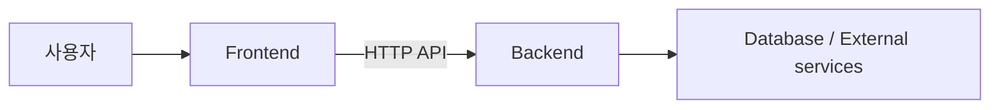

# Architecture

> 상태: Draft — 기술 스택 확정 후 구체화한다.

## 시스템 컨텍스트

## 경계와 책임

| 영역 | 책임 | 금지 사항 |
| --- | --- | --- |
| `frontend/` | 화면, 사용자 상호작용, 클라이언트 상태, API 호출 | 서버 비밀값 보관, 핵심 권한 판정 |
| `backend/` | 비즈니스 규칙, 데이터 접근, 인증·권한, 외부 서비스 연동 | UI 표현 로직 |
| `docs/` | 스펙, 구조, 의사결정, 협업 규칙 | 실행 코드 |

## 기본 의존 원칙

- 프런트엔드는 문서화된 API 계약에만 의존한다.
- 백엔드는 프런트엔드 구현 세부사항에 의존하지 않는다.
- 외부 서비스 호출은 백엔드 경계 안에 둔다.
- 공유 계약이 필요하면 중복 복사하지 말고 위치를 ADR로 결정한다.

## 데이터 흐름

TBD — 핵심 사용자 시나리오가 확정되면 요청, 처리, 저장, 응답 순서를 기록한다.

## 배포 구조

TBD — 배포 대상과 환경이 정해지면 개발/시연 환경을 구분해 기록한다.

## 품질 속성

- 변경 용이성: 프런트엔드와 백엔드를 독립적으로 실행·검증할 수 있어야 한다.
- 보안: 입력은 신뢰하지 않으며 서버에서 검증한다.
- 복구 가능성: 외부 연동 실패가 전체 프로세스를 불명확하게 멈추지 않아야 한다.
