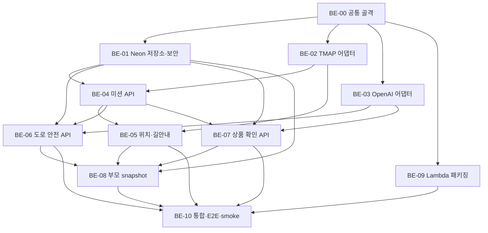

# 첫 심부름 도우미 백엔드 병렬 구현 계획

> 상태: Ready for parallel execution<br>
> 기준 PR: [#6](https://github.com/kimjiwoo2/Codex-Hackathon/pull/6)<br>
> 목표 시간: 여러 Codex 세션을 사용해 3시간 안에 통제된 데모 완성<br>
> 범위: 백엔드와 AWS Lambda 배포. 프런트엔드 화면 구현은 포함하지 않음

## 1. 목표 결과

아래 한 경로가 실제 HTTP API로 끊김 없이 이어져야 한다.

`부모 생성 → 아이 코드 참여 → 마트행 안내 → 역방향/이탈 안내 → 도로 경고 → 상품 확인 → 귀가 전환 → 귀가 안내 → 완료 → 부모 polling 확인`

이 계획의 완료 결과는 보호자가 동행·관찰하는 해커톤 데모다. OpenAI 비전이 도로 횡단 안전을 보장하지 않으므로 실제 아이가 혼자 의존하는 제품 출시는 완료 조건이 아니다.

## 2. 동결된 계약

### 상태

`WAITING → GOING → SHOPPING → RETURNING → COMPLETED`

- 코드 참여 시 `WAITING → GOING`
- 마트 반경 30m 이내 유효 위치 2회 시 `GOING → SHOPPING`
- 모든 상품 `MATCH` 또는 귀가 명령 시 `RETURNING`
- 상품 결과와 무관하게 `GOING/SHOPPING → RETURNING` 허용
- 집 반경 30m 이내 유효 위치 2회 시 `COMPLETED`

### API

```text
POST /missions
POST /missions/join
POST /missions/{missionId}/locations
POST /missions/{missionId}/vision/road
POST /missions/{missionId}/items/{itemId}/verify
POST /missions/{missionId}/commands/return-home
GET  /missions/{missionId}/snapshot?afterEventId={cursor}
```

### 안전 불변식

- 도로 AI 결과는 `STOP | CAUTION | UNKNOWN`만 허용한다.
- `GO`, `CROSS_OK`, “건너도 된다”와 동등한 결과는 schema와 후처리에서 금지한다.
- TMAP step이 횡단보도면 AI 결과와 무관하게 `STOP`을 우선한다.
- AI 오류·timeout·오래된 프레임은 `UNKNOWN`과 정지 안내로 낮춘다.
- 도로 요청의 `capturedAt`은 필수다. 서버 시각보다 10초 넘게 오래되었거나 5초 넘게 미래이면 OpenAI를 호출하지 않고 `UNKNOWN`으로 처리한다.
- 미션별 도로 비전 single-flight는 인메모리 lock이 아니라 DB의 `road_vision_lease_until`을 원자적으로 획득하는 방식으로 보장한다. lease를 얻지 못한 프레임은 `409 ROAD_VISION_BUSY`로 버린다.
- 원본 도로·상품 이미지와 Base64는 DB와 로그에 저장하지 않는다.
- TMAP 최초 실패 시 실제 미션을 시작하지 않고 경로를 추측하지 않는다.

### 데이터

세 테이블만 사용한다.

- `missions`: 상태, 역할 토큰 해시, 장소, 왕복 경로, 최신 위치·현재 step·진행도·판정 streak·도로 비전 lease
- `mission_items`: 요청 조건과 마지막 상품 판정
- `mission_events`: 부모 알림과 정규화된 비전/상태 이벤트

## 3. 현재 기준선

- FastAPI 앱 조립 지점: `backend/src/app/main.py`
- 전역 라우터 hot spot: `backend/src/app/api/router.py`
- 공통 테스트 fixture hot spot: `backend/tests/conftest.py`
- 저장소 경계: `backend/src/app/repositories/`
- 현재 구현 API: `GET /health`
- 의존성 기준: `backend/pyproject.toml`, `backend/uv.lock`

기능 세션은 `main.py`, `api/router.py`, `tests/conftest.py`, `pyproject.toml`, `uv.lock`을 수정하지 않는다. 이 파일은 BE-00과 최종 BE-10만 순차적으로 소유한다.

## 4. 작업 의존 그래프



BE-06은 BE-05의 service 구현에 의존하지 않는다. BE-01이 `current_step_kind` 저장 계약을 만들고 BE-04가 초기 step을 기록하며 BE-05가 이후 위치 update마다 갱신한다. BE-06은 그 값만 읽어 횡단보도 우선 규칙을 적용하므로 BE-05와 병렬 구현할 수 있다.

## 5. 병렬 실행 파형

### 00:00–00:10 외부 preflight

통합 담당 세션은 BE-00과 병렬로 아래 실호출을 확인한다.

- TMAP 보행 경로 1회
- OpenAI 이미지 입력 1회
- Neon pooled URL `SELECT 1`
- AWS Lambda/IAM/Function URL 생성 권한

실패해도 mock 기반 구현은 계속한다. 다만 BE-10 결과를 `CODE_COMPLETE / SMOKE_BLOCKED_BY_ENV`로 분리해 기록하며 실제 외부 연동 완료로 표시하지 않는다.

| 벽시계 | Wave | 병렬 작업 | 종료 조건 |
| --- | --- | --- | --- |
| 00:00–00:20 | W0 | BE-00 | 공통 설정·오류·dependency override 계약 고정 |
| 00:20–00:50 | W1 | BE-01, BE-02, BE-03, BE-09 | DB/TMAP/OpenAI/Lambda 경계가 각각 독립 테스트 통과 |
| 00:50–01:15 | W2 | BE-04 | 생성·참여·역할 토큰·상태 전이 통과 |
| 01:15–01:55 | W3 | BE-05, BE-06, BE-07 | 길안내·도로·상품 API가 독립 테스트 통과 |
| 01:55–02:20 | W4 | BE-08 | 부모 polling snapshot과 이벤트 cursor 통과 |
| 02:20–03:00 | W5 | BE-10 | 라우터 통합, 전체 E2E, AWS smoke와 P0 수정 |

02:20 이후 새 기능이나 리팩터링을 시작하지 않는다. 남은 시간은 통합 실패와 P0 안전 결함에만 쓴다.

## 6. 원자적 작업 목록

### BE-00 — 공통 설정·오류·테스트 골격

- 예상: 20분
- 선행: PR #6
- 단일 소유 경로:
  - `backend/src/app/core/**`
  - `backend/src/app/api/errors.py`
  - `backend/src/app/api/dependencies.py`
  - `backend/src/app/schemas/common.py`
  - `backend/src/app/main.py`
  - `backend/tests/conftest.py`
  - `backend/tests/fixtures/**`
  - `backend/.env.example`

하위 작업:

1. `os.environ` 기반 설정 객체와 필수/선택 환경 변수 계약을 만든다.
2. `{error: {code, message}}` 공통 오류 응답과 역할 의존성 protocol을 만든다.
3. 테스트 앱, dependency override, TMAP/OpenAI mock fixture를 만든다.
4. 기존 `/health` 회귀 테스트를 유지한다.

완료 조건:

- [ ] 비밀값 없이 설정을 import할 수 있다.
- [ ] 필수 환경 변수 누락 오류가 명시적이다.
- [ ] 공통 오류 schema 단위 테스트가 통과한다.
- [ ] 외부 네트워크 없이 테스트 앱 fixture가 동작한다.

제외: DB 모델, 기능 router, 외부 API 호출 구현.

### BE-01 — Neon 모델·저장소·역할 토큰

- 예상: 30분
- 선행: BE-00
- 단일 소유 경로:
  - `backend/src/app/db/**`
  - `backend/src/app/models/**`
  - `backend/src/app/repositories/**`
  - `backend/src/app/security/**`
  - `backend/tests/unit/repositories/**`
  - `backend/tests/unit/security/**`
  - `backend/tests/integration/repositories/**`

하위 작업:

1. 세 테이블과 enum을 SQLAlchemy 2로 정의한다.
2. Neon pooled URL, `pool_pre_ping=True`, 작은 pool을 사용하는 session factory를 만든다.
3. `last_location_at`, `last_accuracy_m`, `current_route_kind`, `current_step_index`, `current_step_kind`, `progress_m`, `off_route_streak`, `wrong_way_streak`, `arrival_streak`, `last_road_event_at`, `road_vision_lease_until` 저장 필드를 고정한다.
4. 6자리 join code와 부모/아이 opaque token을 만들고 해시만 저장한다.
5. 생성·조회·최신 위치·상품 판정·event append/query와 도로 비전 lease acquire/release repository를 구현한다.

완료 조건:

- [ ] `Base.metadata.create_all()`로 빈 DB를 초기화할 수 있다.
- [ ] 미션 aggregate 저장·조회 round trip이 통과한다.
- [ ] 평문 token과 join code가 DB에 남지 않는다.
- [ ] `afterEventId` 이후 이벤트가 오름차순으로 조회된다.
- [ ] 도로 비전 lease의 원자적 획득·만료·해제가 동시성 테스트를 통과한다.

제외: HTTP endpoint와 외부 API 호출.

### BE-02 — TMAP 왕복 보행 경로 어댑터

- 예상: 25분
- 선행: BE-00
- 단일 소유 경로:
  - `backend/src/app/integrations/tmap/**`
  - `backend/src/app/schemas/navigation/route.py`
  - `backend/tests/unit/integrations/test_tmap.py`
  - `backend/tests/fixtures/tmap/**`

하위 작업:

1. 보행자 경로 REST 요청과 timeout을 구현한다.
2. GeoJSON을 geometry, 누적 거리, `turnType`, 횡단보도 여부가 있는 내부 route로 변환한다.
3. 집→마트와 마트→집을 한 호출 인터페이스로 준비한다.
4. 오류를 `TmapUnavailable`로 정규화하고 경로를 추측하지 않는다.

완료 조건:

- [ ] 공식 응답 fixture가 내부 route schema로 변환된다.
- [ ] 좌·우회전, 횡단보도, 계단 정보가 보존된다.
- [ ] timeout·4xx·5xx·빈 경로가 명시적 오류가 된다.

제외: GPS progress와 미션 저장.

### BE-03 — OpenAI 비전 공통 어댑터

- 예상: 25분
- 선행: BE-00
- 단일 소유 경로:
  - `backend/src/app/integrations/openai/**`
  - `backend/src/app/schemas/vision/common.py`
  - `backend/tests/unit/integrations/test_openai_vision.py`
  - `backend/tests/fixtures/openai/**`

하위 작업:

1. Responses API 이미지 입력과 8초 timeout을 구현한다.
2. road `detail=low`, product `detail=high` 호출 옵션을 분리한다.
3. JSON schema 파싱과 표준 `VisionUnavailable` 오류를 만든다.
4. raw model text와 이미지가 로그에 남지 않도록 한다.

완료 조건:

- [ ] road/product 구조화 응답 fixture가 파싱된다.
- [ ] timeout·SDK 오류·잘못된 JSON이 안전한 내부 오류가 된다.
- [ ] adapter API 밖으로 SDK 객체와 원문 문구가 노출되지 않는다.

제외: 최종 안전 clamp와 사용자 메시지.

### BE-04 — 미션 생성·참여·상태 전이 API

- 예상: 25분
- 선행: BE-01, BE-02
- 단일 소유 경로:
  - `backend/src/app/api/missions.py`
  - `backend/src/app/schemas/mission.py`
  - `backend/src/app/services/mission.py`
  - `backend/tests/unit/services/test_mission.py`
  - `backend/tests/integration/api/test_missions.py`

하위 작업:

1. `POST /missions`에서 왕복 TMAP 경로를 준비하고 미션을 저장한다.
2. `POST /missions/join`에서 join code를 1회 소비하고 child token을 발급한다.
3. 상태 전이 규칙과 role authorization을 구현한다.
4. `commands/return-home`을 상품 상태와 무관하게 허용한다.

완료 조건:

- [ ] 생성 응답에 `missionId`, 6자리 `joinCode`, `parentToken`이 있다.
- [ ] 참여 응답에 `childToken`, `status=GOING`, 첫 안내가 있다.
- [ ] 부모/아이 endpoint 권한이 분리된다.
- [ ] 불법 상태 전이는 409이고 안전 귀가는 항상 가능하다.

제외: 위치 계산, 비전, 전역 router 등록.

### BE-05 — 위치 업데이트·길안내·이탈 판정

- 예상: 40분
- 선행: BE-02, BE-04
- 단일 소유 경로:
  - `backend/src/app/api/locations.py`
  - `backend/src/app/schemas/navigation/guidance.py`
  - `backend/src/app/services/navigation.py`
  - `backend/tests/unit/services/test_navigation.py`
  - `backend/tests/integration/api/test_locations.py`
  - `backend/tests/fixtures/gps/**`

하위 작업:

1. Haversine, bearing, 최근접 경로점, progress 계산을 순수 함수로 만든다.
2. 정확도 30m 이하 샘플만 이탈·역방향 판정에 사용한다.
3. 30m 이탈 또는 heading 차이 120도를 2회 debounce한다.
4. 회전·횡단보도·이탈·도착을 고정 음성 문구와 진동 hint로 반환한다.
5. 위치 update마다 `current_step_index`, `current_step_kind`, streak와 progress를 repository에 갱신한다.
6. 마트/집 도착에 따라 `SHOPPING`/`COMPLETED`를 전이한다.

완료 조건:

- [ ] 정상·역방향·이탈·정확도 불량 trace 테스트가 각각 통과한다.
- [ ] 위치 API가 `status`, `instructionCode`, `message`, 거리, `offRoute`, `wrongWay`를 반환한다.
- [ ] 왕복 캐시만 사용하며 GPS 요청마다 TMAP을 호출하지 않는다.
- [ ] 횡단보도 step은 정지 안내를 반환한다.

제외: 자동 재탐색과 위치 이력 저장.

### BE-06 — 도로 상황 안전 판단 API

- 예상: 30분
- 선행: BE-01, BE-03, BE-04
- 단일 소유 경로:
  - `backend/src/app/api/road_vision.py`
  - `backend/src/app/schemas/vision/road.py`
  - `backend/src/app/services/road_vision.py`
  - `backend/tests/unit/services/test_road_vision.py`
  - `backend/tests/integration/api/test_road_vision.py`

하위 작업:

1. 1MB 이하 JPEG 한 장만 검증해 adapter에 전달한다.
2. 필수 `capturedAt`이 10초보다 오래되었거나 5초보다 미래면 OpenAI 호출 없이 `UNKNOWN`으로 반환한다.
3. DB `road_vision_lease_until`을 조건부 update로 획득하고 10초 lease가 이미 있으면 `409 ROAD_VISION_BUSY`로 프레임을 버린다.
4. `current_step_kind=CROSSWALK`이면 모델 결과와 무관하게 최종 `STOP`을 반환한다.
5. 모델 출력을 `STOP | CAUTION | UNKNOWN`으로 clamp한다.
6. 고정 아이 메시지와 `ROAD_HAZARD`/`VISION_UNAVAILABLE` 이벤트를 만든다.
7. `last_road_event_at`을 이용해 동일 이벤트 30초 dedupe를 적용하고 finally에서 lease를 해제한다.

완료 조건:

- [ ] 임의 모델 출력에도 허용 enum 외 결과가 API에서 나오지 않는다.
- [ ] `CROSS_OK`, “건너도 된다” 입력이 `UNKNOWN` 또는 `STOP`으로 바뀐다.
- [ ] timeout은 500이 아니라 `UNKNOWN`과 부모 이벤트가 된다.
- [ ] stale/future frame은 OpenAI mock이 호출되지 않으며 `UNKNOWN`이 된다.
- [ ] 동시 두 요청 중 하나만 vision adapter를 호출한다.
- [ ] 저장된 현재 step이 횡단보도면 AI가 `CAUTION`이어도 최종 결과는 `STOP`이다.
- [ ] 이미지 bytes가 repository와 로그에 전달되지 않는다.

제외: 연속 영상 스트리밍과 background worker.

### BE-07 — 상품 확인 API

- 예상: 25분
- 선행: BE-01, BE-03, BE-04
- 단일 소유 경로:
  - `backend/src/app/api/item_vision.py`
  - `backend/src/app/schemas/vision/item.py`
  - `backend/src/app/services/item_vision.py`
  - `backend/tests/unit/services/test_item_vision.py`
  - `backend/tests/integration/api/test_item_vision.py`

하위 작업:

1. item name·brand·size와 근접 JPEG를 비교 요청한다.
2. 결과를 `MATCH | SIMILAR | MISMATCH | UNKNOWN`으로 정규화한다.
3. 마지막 판정·감지 label·짧은 설명만 저장한다.
4. 모든 상품 `MATCH` 시 귀가 전환을 요청하되 실패 상품이 수동 귀가를 막지 않게 한다.

완료 조건:

- [ ] 네 판정과 고정 사용자 문구가 테스트된다.
- [ ] 다른 미션의 item 접근이 차단된다.
- [ ] 판정은 저장되고 원본 이미지는 저장되지 않는다.
- [ ] 상품 `UNKNOWN/MISMATCH` 상태에서도 귀가 명령이 성공한다.

제외: 상품 카탈로그와 이미지 장기 저장.

### BE-08 — 부모 snapshot·이벤트 polling

- 예상: 25분
- 선행: BE-01, BE-05, BE-06, BE-07
- 단일 소유 경로:
  - `backend/src/app/api/parent_snapshot.py`
  - `backend/src/app/schemas/parent.py`
  - `backend/src/app/services/parent_snapshot.py`
  - `backend/tests/unit/services/test_parent_snapshot.py`
  - `backend/tests/integration/api/test_parent_snapshot.py`

하위 작업:

1. 최신 위치·상태·남은 거리·상품 판정을 한 snapshot으로 조합한다.
2. `afterEventId` 이후 이벤트와 다음 cursor를 반환한다.
3. `lastLocationAt`으로 장시간 미수신을 조회 시 계산한다.
4. parent role만 조회할 수 있게 한다.

완료 조건:

- [ ] 동일 cursor polling이 중복 이벤트를 만들지 않는다.
- [ ] 이탈·도로·상품·도착 이벤트가 다음 3초 polling에서 보인다.
- [ ] background job 없이 장시간 정지/미수신 상태를 표현한다.

제외: push 알림과 WebSocket.

### BE-09 — AWS Lambda 패키징과 Function URL

- 예상: 30분 준비 + 최종 smoke 10분
- 선행: BE-00, 최종 smoke는 BE-10 통합 후
- 단일 소유 경로:
  - `backend/src/app/lambda_handler.py`
  - `backend/deploy/**`
  - `backend/tests/unit/test_lambda_handler.py`
  - `docs/deployment/backend-lambda.md`

하위 작업:

1. `Mangum(app)` handler를 만든다.
2. Linux x86_64용 `psycopg[binary]`를 포함하는 재현 가능한 zip 빌드를 만든다.
3. Lambda Python 3.12와 Function URL CORS 배포 명령을 문서화한다.
4. 환경 변수 이름만 배포 설정에 연결하고 값은 커밋하지 않는다.

완료 조건:

- [ ] Linux artifact에서 `app`, `psycopg`, `openai`, `mangum` import가 성공한다.
- [ ] zip 크기와 handler 경로가 Lambda 제한 안에 있다.
- [ ] Function URL `/health`가 200을 반환한다.

제외: API Gateway, VPC, CloudFormation 전면 구축, 운영 모니터링.

### BE-10 — 라우터 통합·E2E·외부 smoke

- 예상: 40분
- 선행: BE-05, BE-06, BE-07, BE-08, BE-09
- 단일 소유 경로:
  - `backend/src/app/api/router.py`
  - `backend/src/app/main.py`
  - `backend/tests/conftest.py`
  - `backend/tests/integration/e2e/**`
  - `backend/README.md`

하위 작업:

1. 모든 feature router와 dependency override를 전역 앱에 연결한다.
2. mocked TMAP/OpenAI happy path E2E를 만든다.
3. OpenAI 실패와 금지 횡단 판단을 포함한 safe degradation E2E를 만든다.
4. 실제 Neon·TMAP·OpenAI·Lambda Function URL smoke를 순서대로 수행한다.
5. 환경 변수·로컬 실행·시연 절차를 README와 맞춘다.

완료 조건:

- [ ] `생성 → 참여 → 안내 → 도로 경고 → 상품 확인 → 귀가 → 완료 → 부모 조회`가 한 테스트로 통과한다.
- [ ] 어떤 응답·이벤트·음성에도 횡단 허가 표현이 없다.
- [ ] `uv run ruff format --check .`, `uv run ruff check .`, `uv run pytest`가 통과한다.
- [ ] AWS endpoint에서 health, TMAP 1회, OpenAI road/product 각 1회, Neon 저장을 확인한다.
- [ ] 외부 자격 증명 때문에 smoke가 불가능하면 mock E2E 통과와 `SMOKE_BLOCKED_BY_ENV` 근거를 분리해 보고한다.

제외: P1 기능과 코드 미관 리팩터링.

## 7. Codex 세션 작업 규칙

### 이슈 claim

1. 작업 전 이슈 담당자와 기존 `CLAIMED` 댓글을 확인한다.
2. 비어 있으면 자신을 assign하고 `CLAIMED: <branch-name>` 댓글을 남긴다.
3. 하나의 세션은 동시에 하나의 이슈만 claim한다.
4. 막히면 `BLOCKED: <원인> / NEEDS: <필요 이슈 또는 정보>` 댓글을 남기고 다른 범위로 확장하지 않는다.

### 브랜치와 PR

- PR #6이 merge 전이면 `origin/codex/refactor/backend-structure`에서 분기하고 해당 브랜치를 PR base로 사용한다.
- PR #6이 merge된 뒤에는 최신 `origin/main`에서 분기한다.
- 브랜치: `codex/feat/issue-<번호>-<short-name>`
- PR 본문에 `Closes #<번호>`와 검증 결과를 기록한다.
- 각 이슈의 단일 소유 경로 밖 파일은 수정하지 않는다.
- feature 이슈는 `api/router.py`, `main.py`, `tests/conftest.py`, dependency 파일을 건드리지 않는다. 연결은 BE-10이 담당한다.

### 병렬 작업 중 계약 변경

- API enum, 공통 오류, repository protocol을 바꿔야 하면 구현을 멈추고 이슈에 `CONTRACT CHANGE` 댓글을 남긴다.
- 관련 세션이 모두 확인하기 전에는 공유 계약을 독자적으로 변경하지 않는다.
- 비밀값과 실제 아동 위치·이미지는 issue, PR, fixture, 로그에 올리지 않는다.

## 8. 검증 행렬

| 규칙 | 단위 | 통합 | E2E/실호출 |
| --- | --- | --- | --- |
| 상태 전이·안전 귀가 | BE-04 | BE-04 | BE-10 |
| 토큰·role 분리 | BE-01 | BE-04 | BE-10 |
| TMAP 정규화 | BE-02 | BE-04/05 mock | BE-10 실호출 |
| 역방향·이탈 debounce | BE-05 | BE-05 | BE-10 |
| 도로 safe clamp | BE-06 | BE-06 | BE-10 |
| 상품 판정·미저장 | BE-07 | BE-07 | BE-10 |
| event cursor polling | BE-01/08 | BE-08 | BE-10 |
| Lambda import·HTTP | BE-09 | BE-09 | BE-10 |

## 9. 중단 조건과 폴백

- `TMAP_APP_KEY`가 없으면 fixture 기반 병렬 구현은 계속하지만 실제 미션 완료로 표기하지 않는다.
- OpenAI 실패는 road/product `UNKNOWN`으로 안전하게 낮추며 전체 API를 중단하지 않는다.
- Neon 실패 시 테스트용 SQLite는 사용할 수 있지만 배포 완료로 표기하지 않는다.
- Lambda 배포 실패 시 로컬 E2E 결과는 보존하되 AWS 완료 조건은 미충족으로 남긴다.
- 3시간 종료 시 미완료 기능을 숨기지 않고 umbrella issue에 체크되지 않은 항목으로 남긴다.

## 10. 전체 Definition of Done

- [ ] 11개 작업 이슈의 완료 조건이 모두 충족되거나 미완료가 명시된다.
- [ ] 부모와 아이 역할의 전체 P0 흐름이 HTTP E2E로 이어진다.
- [ ] 부모가 3초 polling으로 최신 위치·상태·상품·알림을 본다.
- [ ] 아이가 마트행·귀가에서 즉시 TTS로 읽을 수 있는 문구를 받는다.
- [ ] 도로 AI가 횡단 허가를 낼 수 없음이 자동화 테스트로 증명된다.
- [ ] 원본 프레임과 평문 token이 저장·로그되지 않는다.
- [ ] AWS Function URL, Neon, TMAP, OpenAI 실호출 smoke가 통과한다.
- [ ] 시연은 보호자 동행 통제 데모로 제한된다고 명시된다.
